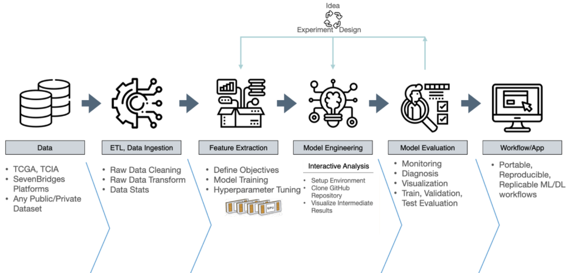

  

# Sesión 3 - Aportes a propuestas de Investigación

### Context
This session explores how to connect **data analysis and machine learning models** with **business objectives** in order to generate real value.  

The key reflection throughout the session is:

> **How do the data in your project connect to your objectives to solve the real problem?**

Students should continuously reflect on **their own project goals** and how their data, analysis, and models support meaningful decisions.

## Introduction — From Data to Value

Having data does not automatically create value.  
Having models does not automatically create value either.

Real value appears when **data informs better decisions**.

  

## The Role of Data

Data should exist to answer meaningful questions. However, a common mistake is:

> **We have data → let's see what we can do with it**

A better approach is:

> **We have a problem → what data explains it?**

## Applied Example

Imagine asking someone to describe their dream house.

Most people would talk about things like:

- The number of bedrooms  
- A beautiful garden  
- A white-picket fence  
- A modern kitchen  

However, when we analyze real housing data, we discover something interesting.

Many factors that influence house prices are not immediately obvious.  
For example:

- The height of the basement ceiling  
- The proximity to a railroad  
- The age of the property  
- The type of neighborhood zoning  
- The quality of construction materials  

These hidden factors can strongly influence price negotiations in the housing market.

### Dataset - House Prices

With 79 explanatory variables describing (almost) every aspect of residential homes in Ames, Iowa, this competition challenges you to predict the final price of each home.

#### [Link](https://www.kaggle.com/competitions/house-prices-advanced-regression-techniques/data?select=train.csv)

### Code 

Notebook available [here](https://github.com/rubenfonnegra/Seminario_BigData/blob/master/Sess3-Propuestas%20de%20Investigacion/sources/notebooks/Seminario_practico.ipynb)

## Evaluating Whether a Project Generates Value

A project generates value if it clearly answers:

1. What decision improves?
2. What action changes?
3. How will impact be measured?

If these questions cannot be answered clearly, the project is likely **not yet connected to business value**.

## Common Mistakes in Data Projects

Three frequent problems:

1. Focusing on algorithms before defining the problem.
2. Using available data instead of relevant data.
3. Optimizing technical metrics without considering impact.

---

### 🗣️ Profesor: Ruben D. Fonnegra

   
  
  